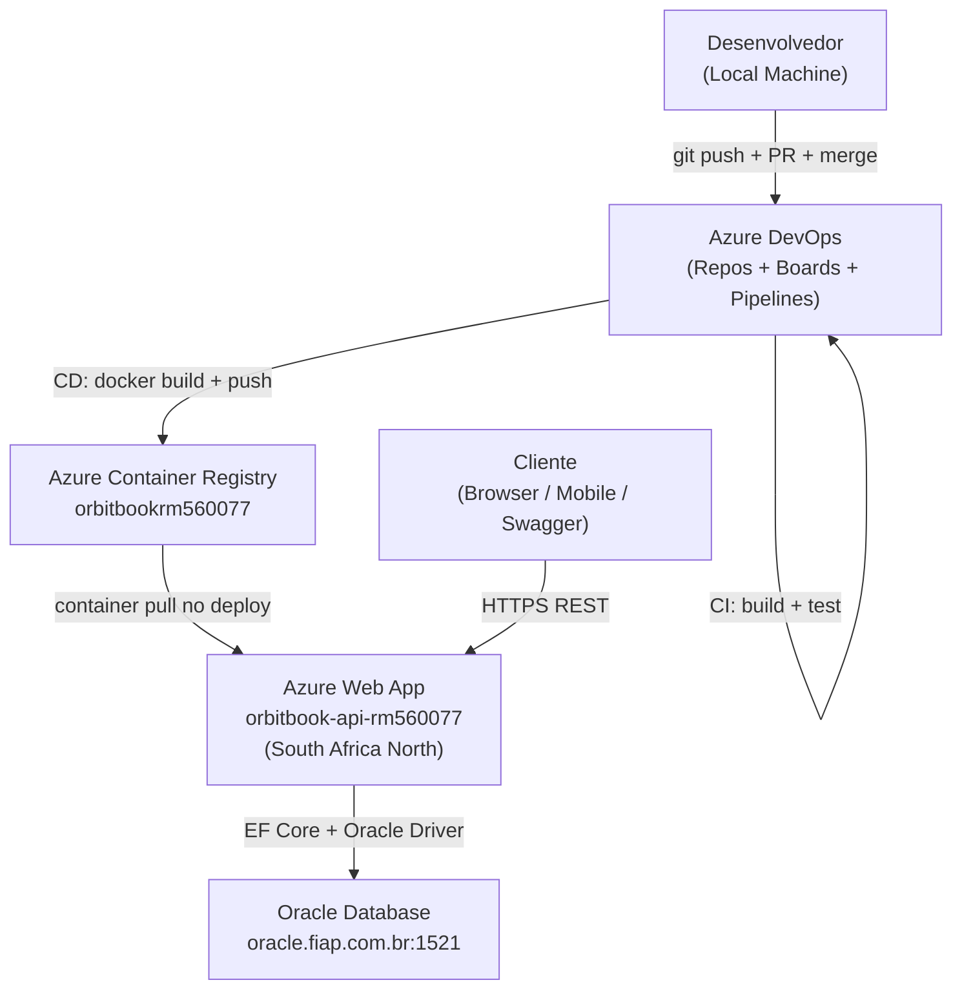
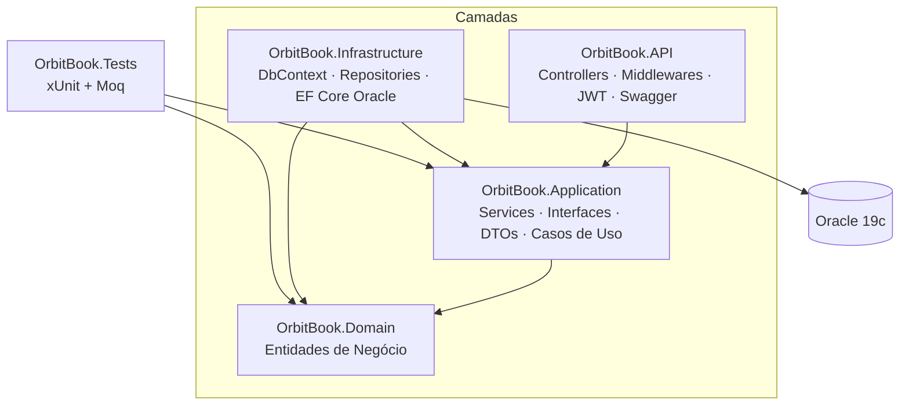
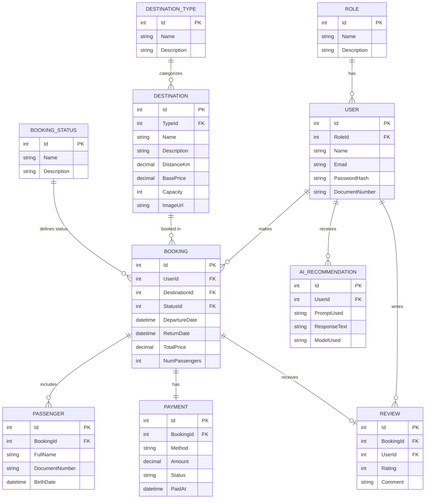
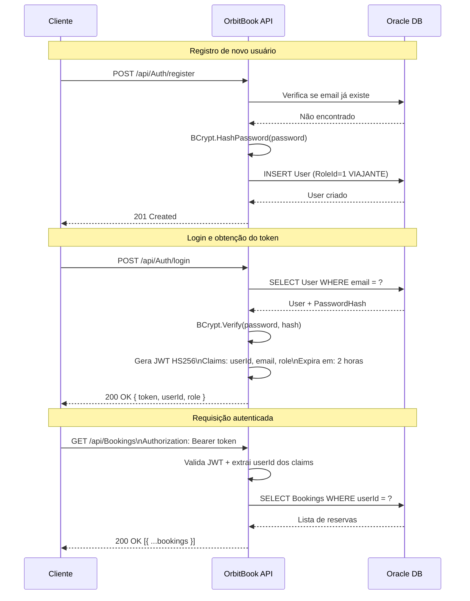
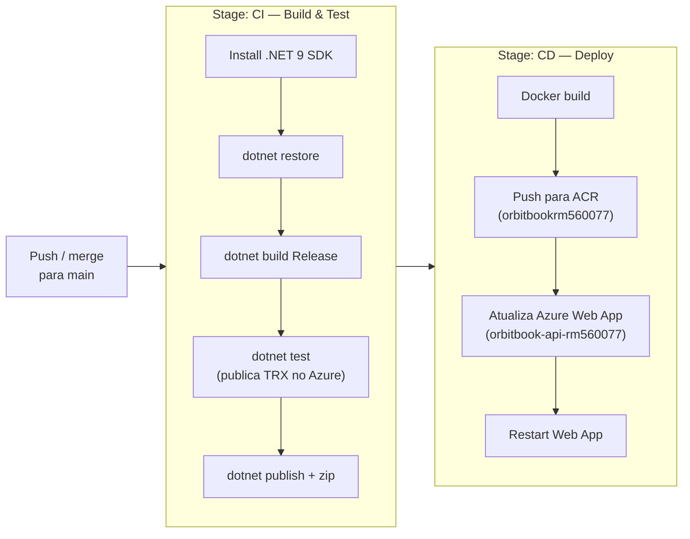

# OrbitBook API


API REST para reservas de viagens espaciais. Cobre o ciclo completo de um viajante: explorar destinos, criar reservas, gerenciar passageiros e processar pagamentos — tudo com autenticação JWT e banco de dados Oracle.

> **Live API:** `https://orbitbook-api-rm560077.azurewebsites.net`
> **Swagger UI:** `https://orbitbook-api-rm560077.azurewebsites.net/swagger`

---

## Sumário

- [Macro Arquitetura](#macro-arquitetura)
- [Clean Architecture](#clean-architecture)
- [Diagrama de Entidades](#diagrama-de-entidades)
- [Fluxo de Autenticação](#fluxo-de-autenticação)
- [Configuração e Execução Local](#configuração-e-execução-local)
- [Endpoints da API](#endpoints-da-api)
- [Exemplos de Requisições](#exemplos-de-requisições)
- [Testes](#testes)
- [Docker](#docker)
- [CI/CD](#cicd)
- [Estrutura do Repositório](#estrutura-do-repositório)

---

## Macro Arquitetura



| Componente | Recurso | Descrição |
|---|---|---|
| Source Control | Azure Repos | Git com branch `main` protegida |
| Work Items | Azure Boards | Issues vinculados a commits e PRs |
| CI/CD | Azure Pipelines (YAML) | Build, test, Docker push, deploy |
| Container Registry | Azure ACR (`orbitbookrm560077`) | Armazena imagens Docker |
| Hosting | Azure Web App (Linux container) | Executa a API .NET 9 |
| Banco de Dados | Oracle 19c (`oracle.fiap.com.br`) | PaaS via FIAP |
| IaC | `scripts/script-infra-azure.sh` | Provisiona todos os recursos Azure |

---

## Clean Architecture

O projeto segue **Clean Architecture** com quatro camadas bem definidas. A regra de dependência é estrita: as camadas internas nunca dependem das externas.



| Projeto | Responsabilidade |
|---|---|
| `OrbitBook.Domain` | Entidades puras (`User`, `Booking`, `Destination` etc.), sem dependências externas |
| `OrbitBook.Application` | Casos de uso, interfaces de repositório, DTOs, lógica de negócio |
| `OrbitBook.Infrastructure` | Implementação dos repositórios, configuração do Oracle EF Core, DI |
| `OrbitBook.API` | Controllers HTTP, middlewares, configuração de autenticação JWT, Swagger |
| `OrbitBook.Tests` | Testes unitários com xUnit e Moq, focados na camada Application |

**Stack:**

| Componente | Tecnologia |
|---|---|
| Framework | ASP.NET Core 9.0 |
| Banco de Dados | Oracle 19c+ |
| ORM | Entity Framework Core 8.23 |
| Autenticação | JWT Bearer (HS256) |
| Hash de Senha | BCrypt.Net-Next |
| Documentação | Swagger / OpenAPI |
| Testes | xUnit 2.9.2 + Moq 4.20.72 |
| Containerização | Docker (multi-stage) |
| CI/CD | Azure Pipelines |

---

## Diagrama de Entidades



---

## Fluxo de Autenticação



---

## Configuração e Execução Local

### Pré-requisitos

- [.NET 9 SDK](https://dotnet.microsoft.com/download/dotnet/9.0)
- Acesso ao Oracle Database 19c+
- Docker (opcional)

### 1. Clone o repositório

```bash
git clone https://dev.azure.com/RM560077/orbitbook/_git/orbitbook
cd orbitbook
```

### 2. Configure os segredos

Via variáveis de ambiente (recomendado):

```bash
# Windows PowerShell
$env:ConnectionStrings__Oracle = "Data Source=oracle.fiap.com.br:1521/ORCL;User Id=RM560077;Password=suasenha;"
$env:JwtParameters__Secret     = "OrbitBookSuperSecretKey2025ForJwtTokensNeedToBeLong"
$env:JwtParameters__Issuer     = "OrbitBookApi"
$env:JwtParameters__Audience   = "OrbitBookClients"
```

Ou edite `OrbitBook.API/appsettings.json` (apenas desenvolvimento local):

```json
{
  "ConnectionStrings": {
    "Oracle": "Data Source=oracle.fiap.com.br:1521/ORCL;User Id=RM560077;Password=suasenha;"
  },
  "JwtParameters": {
    "Secret": "OrbitBookSuperSecretKey2025ForJwtTokensNeedToBeLong",
    "Issuer": "OrbitBookApi",
    "Audience": "OrbitBookClients"
  }
}
```

### 3. Build e execução

```bash
dotnet restore
dotnet build
dotnet run --project OrbitBook.API/OrbitBook.API.csproj
```

Endpoints disponíveis:
- API: `http://localhost:5000`
- Swagger UI: `http://localhost:5000/swagger`
- Health Check: `http://localhost:5000/health`

---

## Endpoints da API

> Rotas com 🔒 exigem `Authorization: Bearer <token>`.

### Autenticação — `api/Auth`

| Método | Rota | Auth | Descrição |
|---|---|---|---|
| POST | `/api/Auth/register` | — | Cria novo usuário |
| POST | `/api/Auth/login` | — | Autentica e retorna JWT |
| GET | `/api/Auth/me` | 🔒 | Retorna dados do usuário logado |

### Destinos — `api/Destinations`

| Método | Rota | Auth | Descrição |
|---|---|---|---|
| GET | `/api/Destinations` | — | Lista todos os destinos espaciais |
| GET | `/api/Destinations/{id}` | — | Retorna um destino pelo ID |
| PUT | `/api/Destinations/{id}` | 🔒 | Atualiza dados de um destino |
| DELETE | `/api/Destinations/{id}` | 🔒 | Remove um destino |

### Reservas — `api/Bookings`

| Método | Rota | Auth | Descrição |
|---|---|---|---|
| GET | `/api/Bookings` | 🔒 | Lista reservas do usuário logado |
| GET | `/api/Bookings/{id}` | 🔒 | Retorna uma reserva pelo ID |
| POST | `/api/Bookings` | 🔒 | Cria nova reserva |
| PUT | `/api/Bookings/{id}` | 🔒 | Atualiza reserva (somente status PENDING) |
| DELETE | `/api/Bookings/{id}` | 🔒 | Cancela uma reserva |

**Regras de negócio:**
- `TotalPrice` é calculado automaticamente: `basePrice × numPassengers`
- Só reservas com `StatusId = 1` (PENDING) podem ser editadas
- Cada usuário acessa apenas suas próprias reservas (UserId extraído do JWT)

---

## Exemplos de Requisições

> Todos os exemplos podem ser executados via **Swagger UI**, **Postman** ou **curl**.

### 1. Registrar usuário

```http
POST /api/Auth/register
Content-Type: application/json

{
  "name": "João Silva",
  "email": "joao@email.com",
  "password": "SenhaSegura123!",
  "documentNumber": "123.456.789-00"
}
```

**Resposta `201 Created`**

---

### 2. Login

```http
POST /api/Auth/login
Content-Type: application/json

{
  "email": "joao@email.com",
  "password": "SenhaSegura123!"
}
```

**Resposta `200 OK`:**
```json
{
  "token": "eyJhbGciOiJIUzI1NiIsInR5cCI6IkpXVCJ9...",
  "userId": 1,
  "role": "VIAJANTE"
}
```

> Copie o valor de `token` e use no header `Authorization: Bearer <token>` nas próximas requisições.

---

### 3. Autenticar no Swagger UI

1. Acesse `/swagger`
2. Execute `POST /api/Auth/login` e copie o token
3. Clique em **Authorize** (ícone 🔒 no topo)
4. Digite: `Bearer eyJhbGci...`
5. Clique em **Authorize** — todos os endpoints protegidos ficam liberados

---

### 4. Listar destinos (público)

```http
GET /api/Destinations
```

**Resposta `200 OK`:**
```json
[
  {
    "id": 1,
    "name": "Low Earth Orbit",
    "description": "Experience weightlessness at 400km altitude.",
    "distanceKm": 400,
    "basePrice": 250000.00,
    "capacity": 6,
    "imageUrl": "https://example.com/leo.jpg",
    "typeName": "ORBITAL"
  }
]
```

---

### 5. Criar reserva

```http
POST /api/Bookings
Authorization: Bearer <token>
Content-Type: application/json

{
  "destinationId": 1,
  "departureDate": "2026-09-15T10:00:00",
  "returnDate": "2026-09-22T10:00:00",
  "numPassengers": 2
}
```

**Resposta `201 Created`:**
```json
{
  "id": 10,
  "userId": 1,
  "destinationId": 1,
  "destinationName": "Low Earth Orbit",
  "statusId": 1,
  "statusName": "PENDING",
  "departureDate": "2026-09-15T10:00:00",
  "returnDate": "2026-09-22T10:00:00",
  "totalPrice": 500000.00,
  "numPassengers": 2
}
```

---

### 6. Atualizar reserva

```http
PUT /api/Bookings/10
Authorization: Bearer <token>
Content-Type: application/json

{
  "departureDate": "2026-10-01T10:00:00",
  "returnDate": "2026-10-08T10:00:00",
  "numPassengers": 3
}
```

**Resposta `200 OK`:** retorna a reserva atualizada com `totalPrice` recalculado.

---

### 7. Cancelar reserva

```http
DELETE /api/Bookings/10
Authorization: Bearer <token>
```

**Resposta `204 No Content`**

---

### 8. Atualizar destino

```http
PUT /api/Destinations/1
Authorization: Bearer <token>
Content-Type: application/json

{
  "name": "Low Earth Orbit — Updated",
  "description": "Updated description.",
  "distanceKm": 420,
  "basePrice": 275000.00,
  "capacity": 8,
  "imageUrl": "https://example.com/leo-new.jpg"
}
```

---

## Testes

O projeto utiliza **xUnit** como framework de testes e **Moq** para mocking de dependências, seguindo o padrão **AAA (Arrange / Act / Assert)**.

### Executar os testes

```bash
# Todos os testes
dotnet test

# Com saída detalhada
dotnet test --verbosity normal

# Somente o projeto de testes
dotnet test OrbitBook.Tests/OrbitBook.Tests.csproj --configuration Release

# Com cobertura de código
dotnet test --collect:"XPlat Code Coverage"
```

### Estrutura do projeto de testes

```
OrbitBook.Tests/
└── Services/
    └── AuthServiceTests.cs    ← Testes do AuthService
```

### Casos de teste — `AuthServiceTests`


#### Setup da classe de teste

```csharp
public class AuthServiceTests
{
    private readonly Mock<IUserRepository> _mockUserRepository;
    private readonly Mock<IConfiguration> _mockConfiguration;
    private readonly AuthService _authService;

    public AuthServiceTests()
    {
        _mockUserRepository = new Mock<IUserRepository>();
        _mockConfiguration  = new Mock<IConfiguration>();

        // JWT Secret configurado via mock
        _mockConfiguration
            .Setup(c => c["JwtParameters:Secret"])
            .Returns("OrbitBookSuperSecretKey2025ForJwtTokensNeedToBeLongEnoughToValidate");

        _authService = new AuthService(
            _mockUserRepository.Object,
            _mockConfiguration.Object
        );
    }
}
```

---

#### Teste 1 — Credenciais válidas retornam token

```csharp
[Fact]
public async Task AuthenticateAsync_ComCredenciaisValidas_DeveRetornarToken()
{
    // Arrange
    var email    = "test@email.com";
    var password = "password123";

    var user = new User
    {
        Id           = 1,
        Email        = email,
        PasswordHash = BCrypt.Net.BCrypt.HashPassword(password),
        Role         = new Role { Name = "VIAJANTE" }
    };

    _mockUserRepository
        .Setup(r => r.GetByEmailAsync(email))
        .ReturnsAsync(user);

    // Act
    var result = await _authService.AuthenticateAsync(
        new LoginDto { Email = email, Password = password }
    );

    // Assert
    Assert.NotNull(result);
    Assert.NotEmpty(result.Token);
    Assert.Equal(1, result.UserId);
    Assert.Equal("VIAJANTE", result.Role);
}
```

---

#### Teste 2 — Email não cadastrado retorna null

```csharp
[Fact]
public async Task AuthenticateAsync_ComEmailInvalido_DeveRetornarNulo()
{
    // Arrange
    _mockUserRepository
        .Setup(r => r.GetByEmailAsync(It.IsAny<string>()))
        .ReturnsAsync((User?)null);

    // Act
    var result = await _authService.AuthenticateAsync(
        new LoginDto { Email = "inexistente@email.com", Password = "qualquer" }
    );

    // Assert
    Assert.Null(result);
}
```

---

#### Teste 3 — Senha incorreta retorna null

```csharp
[Fact]
public async Task AuthenticateAsync_ComSenhaInvalida_DeveRetornarNulo()
{
    // Arrange
    var user = new User
    {
        Email        = "test@email.com",
        PasswordHash = BCrypt.Net.BCrypt.HashPassword("senhaCorreta"),
        Role         = new Role { Name = "VIAJANTE" }
    };

    _mockUserRepository
        .Setup(r => r.GetByEmailAsync(It.IsAny<string>()))
        .ReturnsAsync(user);

    // Act
    var result = await _authService.AuthenticateAsync(
        new LoginDto { Email = "test@email.com", Password = "senhaErrada" }
    );

    // Assert
    Assert.Null(result);
}
```

---

### Saída esperada ao rodar os testes

```
Starting test execution, please wait...
A total of 1 test files matched the specified pattern.

  Passed AuthenticateAsync_ComCredenciaisValidas_DeveRetornarToken [~120ms]
  Passed AuthenticateAsync_ComEmailInvalido_DeveRetornarNulo       [~5ms]
  Passed AuthenticateAsync_ComSenhaInvalida_DeveRetornarNulo       [~5ms]

Test Run Successful.
Total tests: 3
     Passed: 3
 Total time: ~1s
```

---

## Docker

### Build da imagem

```bash
docker build -t orbitbook-api .
```

### Executar o container

```bash
docker run -p 8080:8080 \
  -e "ConnectionStrings__Oracle=Data Source=<host>:1521/<service>;User Id=<user>;Password=<pass>;" \
  -e "JwtParameters__Secret=SuaChaveSecreta" \
  orbitbook-api
```

API disponível em `http://localhost:8080` | Swagger em `http://localhost:8080/swagger`.

### Estrutura do Dockerfile (multi-stage)

```
Stage 1: base      → aspnet:9.0 (apenas runtime)
Stage 2: build     → sdk:9.0 (compila a solução)
Stage 3: publish   → gera Release build
Stage 4: final     → copia publish → porta 8080 / 8081
```

---

## CI/CD

Pipeline em `azure-pipelines.yml`, disparado automaticamente em **merge para `main`**.



Segredos (Oracle connection string, JWT secret) são armazenados como **Azure Web App Application Settings**, nunca no código-fonte.

---

## Estrutura do Repositório

```
orbitbook/
├── azure-pipelines.yml              # Pipeline CI/CD (YAML)
├── Dockerfile                       # Multi-stage .NET 9 build
├── scripts/
│   ├── script-infra-azure.sh        # Provisiona recursos Azure via CLI
│   └── script-bd.sql                # DDL Oracle (tabelas, sequências)
├── OrbitBook.API/
│   ├── Controllers/                 # AuthController, BookingsController, DestinationsController
│   ├── Middlewares/                 # GlobalExceptionHandlerMiddleware
│   ├── appsettings.json
│   └── Program.cs
├── OrbitBook.Application/
│   ├── DTOs/                        # RegisterDto, LoginDto, BookingDto, DestinationDto...
│   ├── Interfaces/
│   │   ├── Repositories/            # IUserRepository, IBookingRepository, IDestinationRepository
│   │   └── Services/                # IAuthService, IBookingService, IDestinationService
│   └── Services/                    # AuthService, BookingService, DestinationService
├── OrbitBook.Domain/
│   └── Entities/                    # User, Role, Booking, Destination, Passenger, Payment, Review...
├── OrbitBook.Infrastructure/
│   ├── Data/                        # OrbitBookDbContext
│   ├── DependencyInjection/         # InfrastructureServiceRegistration
│   └── Repositories/                # UserRepository, BookingRepository, DestinationRepository
└── OrbitBook.Tests/
    └── Services/
        └── AuthServiceTests.cs
```

---

## Integrantes

| Nome | RM |
|---|---|
Caio Lucas Silva Gomes RM560077
João Gabriel Fuchss Grecco RM559863
Gabriel Gomes Cardoso RM559597
Julia Damasceno Busso RM560293
Jhonatan Quispe Torrez RM560601