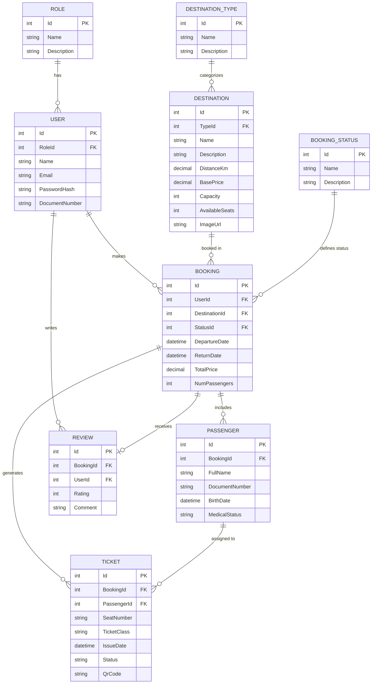
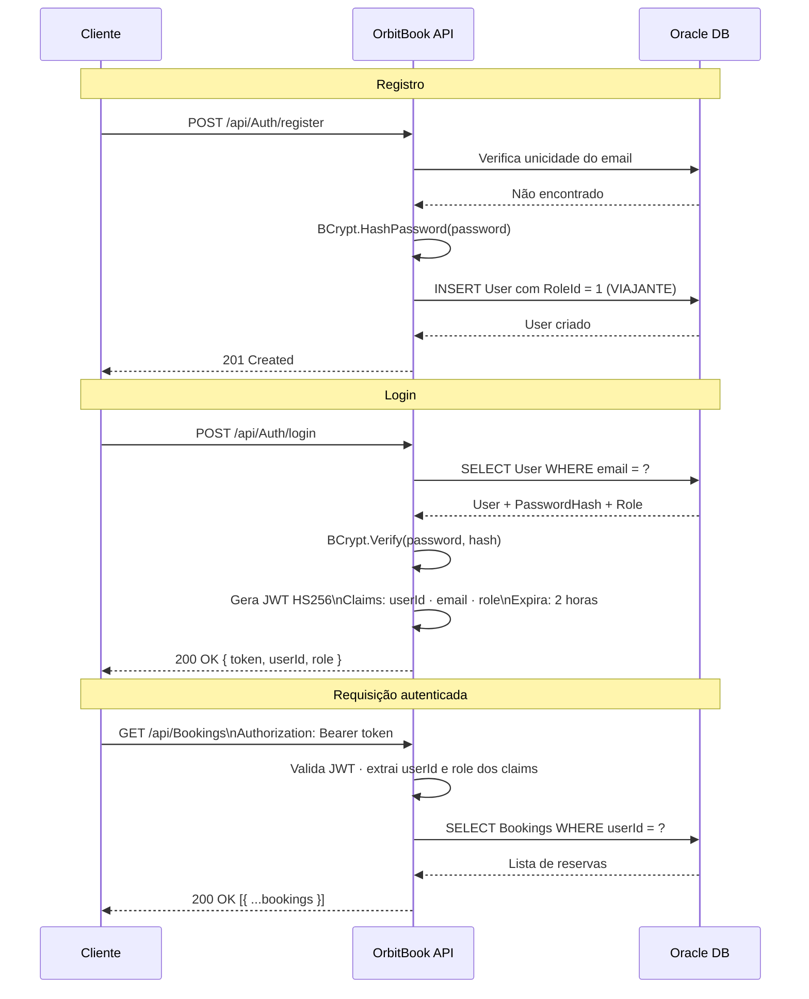
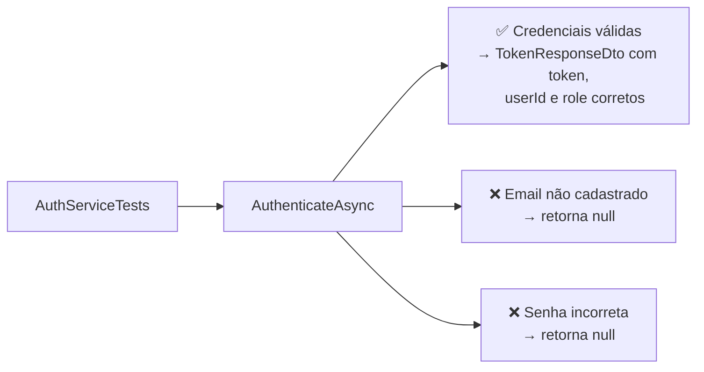

# OrbitBook API


API REST para reservas de viagens espaciais. Cobre o ciclo completo de um viajante: explorar destinos, criar reservas, gerenciar passageiros, emitir tickets e avaliar missões — com autenticação JWT, controle de acesso por perfil (ADMIN / VIAJANTE) e banco de dados Oracle.

---

## Sumário

- [Clean Architecture](#clean-architecture)
- [Diagrama de Entidades](#diagrama-de-entidades)
- [Fluxo de Autenticação](#fluxo-de-autenticação)
- [Configuração e Execução Local](#configuração-e-execução-local)
- [Endpoints da API](#endpoints-da-api)
- [Exemplos de Requisições](#exemplos-de-requisições)
- [Testes](#testes)
- [Docker](#docker)
- [Estrutura do Repositório](#estrutura-do-repositório)
- [Integrantes](#integrantes)

---

## Clean Architecture

O projeto segue **Clean Architecture** com cinco projetos. A regra de dependência é estrita: as camadas internas nunca conhecem as externas.


| Projeto | Responsabilidade |
|---|---|
| `OrbitBook.Domain` | Entidades puras sem dependências externas |
| `OrbitBook.Application` | Casos de uso, interfaces de repositório, DTOs, regras de negócio |
| `OrbitBook.Infrastructure` | Repositórios, `DbContext`, Migrations, seed data, DI |
| `OrbitBook.API` | Controllers HTTP, middlewares, JWT, Swagger |
| `OrbitBook.Tests` | Testes unitários com xUnit e Moq |

**Stack:**

| Componente | Tecnologia |
|---|---|
| Framework | ASP.NET Core 9.0 |
| Banco de Dados | Oracle 19c+ |
| ORM | Entity Framework Core 8.23 |
| Autenticação | JWT Bearer (HS256) |
| Hash de Senha | BCrypt.Net-Next 4.2.0 |
| Documentação | Swagger / OpenAPI |
| Testes | xUnit 2.9.2 + Moq 4.20.72 |
| Containerização | Docker (multi-stage) |

---

## Diagrama de Entidades



### Status de reserva

| StatusId | Nome | Descrição |
|---|---|---|
| 1 | PENDENTE | Reserva criada, aguardando confirmação |
| 2 | CONFIRMADO | Pagamento confirmado |
| 3 | EM_MISSAO | Viagem em andamento |
| 4 | CONCLUIDO | Missão finalizada — permite avaliação |
| 5 | CANCELADO | Reserva cancelada |

---

## Fluxo de Autenticação



### Perfis de acesso

| Role | RoleId | Permissões |
|---|---|---|
| **VIAJANTE** | 1 | Gerencia as próprias reservas, cria avaliações, visualiza tickets |
| **ADMIN** | 2 | Acesso total: gerencia destinos, todos os usuários e todas as reservas |

---

## Configuração e Execução Local

### Pré-requisitos

- [.NET 9 SDK](https://dotnet.microsoft.com/download/dotnet/9.0)
- Acesso ao Oracle Database 19c+
- Docker (opcional)

### 1. Clone o repositório

```bash
git clone https://github.com/caiolucasxz55/OrbitBook.git
cd OrbitBook
```

### 2. Configure os segredos

Via variáveis de ambiente (recomendado):

```powershell
# Windows PowerShell
$env:ConnectionStrings__Oracle = "Data Source=oracle.fiap.com.br:1521/ORCL;User Id=RM560077;Password=suasenha;"
$env:JwtParameters__Secret     = "OrbitBookSuperSecretKey2025ForJwtTokensNeedToBeLong"
$env:JwtParameters__Issuer     = "OrbitBookApi"
$env:JwtParameters__Audience   = "OrbitBookClients"
```

Ou edite `OrbitBook.API/appsettings.json` apenas para desenvolvimento local:

```json
{
  "ConnectionStrings": {
    "Oracle": "Data Source=oracle.fiap.com.br:1521/ORCL;User Id=RM560077;Password=suasenha;"
  },
  "JwtParameters": {
    "Secret": "OrbitBookSuperSecretKey2025ForJwtTokensNeedToBeLong",
    "Issuer": "OrbitBookApi",
    "Audience": "OrbitBookClients"
  }
}
```

### 3. Aplicar migrations e seed data

```bash
dotnet ef database update --project OrbitBook.Infrastructure --startup-project OrbitBook.API
```

O seed cria automaticamente:
- 2 roles: `VIAJANTE`, `ADMIN`
- 5 status de reserva: `PENDENTE` → `CONFIRMADO` → `EM_MISSAO` → `CONCLUIDO` → `CANCELADO`
- 4 tipos de destino: `SUBORBITAL`, `ORBITAL`, `LUNAR`, `INTERPLANETARIO`
- 8 destinos espaciais pré-cadastrados
- 1 usuário admin padrão

### 4. Build e execução

```bash
dotnet restore
dotnet build
dotnet run --project OrbitBook.API/OrbitBook.API.csproj
```

Endpoints disponíveis:
- Swagger UI: `http://localhost:5000/swagger`
- Health Check: `http://localhost:5000/health`

---

## Endpoints da API

> 🔒 = requer `Authorization: Bearer <token>` | 👑 = requer role **ADMIN**

### Autenticação — `/api/Auth`

| Método | Rota | Auth | Descrição |
|---|---|---|---|
| POST | `/api/Auth/register` | — | Registra novo usuário com role VIAJANTE |
| POST | `/api/Auth/login` | — | Autentica e retorna JWT |
| GET | `/api/Auth/me` | 🔒 | Retorna email e role do usuário logado |

### Destinos — `/api/Destinations`

| Método | Rota | Auth | Descrição |
|---|---|---|---|
| GET | `/api/Destinations` | — | Lista todos os destinos |
| GET | `/api/Destinations/{id}` | — | Retorna um destino pelo ID |
| POST | `/api/Destinations` | 🔒 👑 | Cria novo destino |
| PATCH | `/api/Destinations/{id}` | 🔒 👑 | Atualiza dados de um destino |
| DELETE | `/api/Destinations/{id}` | 🔒 👑 | Remove um destino |

### Reservas — `/api/Bookings`

| Método | Rota | Auth | Descrição |
|---|---|---|---|
| GET | `/api/Bookings` | 🔒 | Lista reservas do usuário logado |
| GET | `/api/Bookings/all` | 🔒 👑 | Lista todas as reservas (admin) |
| GET | `/api/Bookings/{id}` | 🔒 | Retorna uma reserva pelo ID |
| POST | `/api/Bookings` | 🔒 | Cria nova reserva |
| PATCH | `/api/Bookings/{id}/status` | 🔒 | Atualiza o status da reserva |
| DELETE | `/api/Bookings/{id}` | 🔒 | Cancela / remove a reserva |

**Regras de negócio:**
- `TotalPrice` calculado automaticamente: `basePrice × numPassengers`
- VIAJANTE só acessa as próprias reservas; ADMIN acessa todas
- Avaliação só é permitida após status `CONCLUIDO`

### Avaliações — `/api/Reviews`

| Método | Rota | Auth | Descrição |
|---|---|---|---|
| GET | `/api/Reviews/destination/{destinationId}` | — | Lista avaliações de um destino |
| POST | `/api/Reviews` | 🔒 | Cria avaliação (reserva deve estar CONCLUIDA) |
| DELETE | `/api/Reviews/{id}` | 🔒 | Remove avaliação (própria ou admin) |

### Tickets — `/api/Tickets`

| Método | Rota | Auth | Descrição |
|---|---|---|---|
| GET | `/api/Tickets/booking/{bookingId}` | 🔒 | Lista tickets de uma reserva |
| POST | `/api/Tickets` | 🔒 | Emite ticket para um passageiro |

### Usuários — `/api/Users`

| Método | Rota | Auth | Descrição |
|---|---|---|---|
| GET | `/api/Users` | 🔒 👑 | Lista todos os usuários |
| GET | `/api/Users/{id}` | 🔒 | Retorna usuário pelo ID (próprio ou admin) |
| DELETE | `/api/Users/{id}` | 🔒 👑 | Remove usuário |

---

## Exemplos de Requisições

> Execute via **Swagger UI**, **Postman** ou **curl**.

### 1. Registrar usuário

```http
POST /api/Auth/register
Content-Type: application/json

{
  "name": "João Silva",
  "email": "joao@email.com",
  "password": "SenhaSegura123!",
  "documentNumber": "123.456.789-00"
}
```

**Resposta `201 Created`**

---

### 2. Login

```http
POST /api/Auth/login
Content-Type: application/json

{
  "email": "joao@email.com",
  "password": "SenhaSegura123!"
}
```

**Resposta `200 OK`:**

```json
{
  "token": "eyJhbGciOiJIUzI1NiIsInR5cCI6IkpXVCJ9...",
  "userId": 1,
  "role": "VIAJANTE"
}
```

> Copie o `token` e use como `Bearer <token>` no header `Authorization`.

---

### 3. Autenticar no Swagger UI

1. Acesse `http://localhost:5000/swagger`
2. Execute `POST /api/Auth/login` e copie o token
3. Clique em **Authorize** (ícone de cadeado no topo da página)
4. Digite: `Bearer eyJhbGci...`
5. Clique em **Authorize** — todos os endpoints protegidos ficam disponíveis

---

### 4. Listar destinos (público)

```http
GET /api/Destinations
```

**Resposta `200 OK`:**

```json
[
  {
    "id": 1,
    "name": "Low Earth Orbit",
    "description": "Experience weightlessness at 400km altitude.",
    "distanceKm": 400,
    "basePrice": 250000.00,
    "capacity": 6,
    "availableSeats": 4,
    "imageUrl": "https://example.com/leo.jpg",
    "typeName": "ORBITAL"
  }
]
```

---

### 5. Criar reserva

```http
POST /api/Bookings
Authorization: Bearer <token>
Content-Type: application/json

{
  "destinationId": 1,
  "departureDate": "2026-09-15T10:00:00",
  "returnDate": "2026-09-22T10:00:00",
  "numPassengers": 2
}
```

**Resposta `201 Created`:**

```json
{
  "id": 10,
  "userId": 1,
  "destinationId": 1,
  "destinationName": "Low Earth Orbit",
  "statusId": 1,
  "statusName": "PENDENTE",
  "departureDate": "2026-09-15T10:00:00",
  "returnDate": "2026-09-22T10:00:00",
  "totalPrice": 500000.00,
  "numPassengers": 2
}
```

---

### 6. Atualizar status da reserva

```http
PATCH /api/Bookings/10/status
Authorization: Bearer <token>
Content-Type: application/json

{
  "statusId": 2
}
```

**Resposta `200 OK`:** retorna a reserva com `statusName: "CONFIRMADO"`.

---

### 7. Criar avaliação (reserva CONCLUIDA)

```http
POST /api/Reviews
Authorization: Bearer <token>
Content-Type: application/json

{
  "bookingId": 10,
  "rating": 5,
  "comment": "Experiência incrível! A ausência de gravidade supera qualquer expectativa."
}
```

**Resposta `201 Created`:**

```json
{
  "id": 3,
  "bookingId": 10,
  "userId": 1,
  "rating": 5,
  "comment": "Experiência incrível! A ausência de gravidade supera qualquer expectativa."
}
```

---

### 8. Emitir ticket para passageiro

```http
POST /api/Tickets
Authorization: Bearer <token>
Content-Type: application/json

{
  "bookingId": 10,
  "passengerId": 5,
  "seatNumber": "A1",
  "ticketClass": "FIRST"
}
```

**Resposta `201 Created`:**

```json
{
  "id": 7,
  "bookingId": 10,
  "passengerId": 5,
  "seatNumber": "A1",
  "ticketClass": "FIRST",
  "issueDate": "2026-06-09T14:30:00",
  "status": "ACTIVE",
  "qrCode": "ORBIT-10-5-A1"
}
```

---

### 9. Criar destino (ADMIN)

```http
POST /api/Destinations
Authorization: Bearer <token-admin>
Content-Type: application/json

{
  "typeId": 3,
  "name": "Lunar Gateway",
  "description": "Estação orbital lunar a 400.000 km da Terra.",
  "distanceKm": 400000,
  "basePrice": 5000000.00,
  "capacity": 4,
  "imageUrl": "https://example.com/lunar-gateway.jpg"
}
```

**Resposta `201 Created`**

---

## Testes

O projeto usa **xUnit** como framework de testes e **Moq** para mocking, seguindo o padrão **AAA (Arrange / Act / Assert)**.

### Executar os testes

```bash
# Todos os testes
dotnet test

# Com saída detalhada
dotnet test --verbosity normal

# Somente o projeto de testes
dotnet test OrbitBook.Tests/OrbitBook.Tests.csproj --configuration Release

# Com cobertura de código
dotnet test --collect:"XPlat Code Coverage"
```

### Estrutura

```
OrbitBook.Tests/
└── Services/
    └── AuthServiceTests.cs
```

### Casos de teste — `AuthServiceTests`



#### Setup da classe

```csharp
public class AuthServiceTests
{
    private readonly Mock<IUserRepository> _mockUserRepository;
    private readonly Mock<IConfiguration> _mockConfiguration;
    private readonly AuthService _authService;

    public AuthServiceTests()
    {
        _mockUserRepository = new Mock<IUserRepository>();
        _mockConfiguration  = new Mock<IConfiguration>();

        _mockConfiguration
            .Setup(c => c["JwtParameters:Secret"])
            .Returns("OrbitBookSuperSecretKey2025ForJwtTokensNeedToBeLongEnoughToValidate");

        _authService = new AuthService(
            _mockUserRepository.Object,
            _mockConfiguration.Object
        );
    }
}
```

---

#### Teste 1 — Credenciais válidas retornam token

```csharp
[Fact]
public async Task AuthenticateAsync_ComCredenciaisValidas_DeveRetornarToken()
{
    // Arrange
    var email    = "test@email.com";
    var password = "password123";

    var user = new User
    {
        Id           = 1,
        Email        = email,
        PasswordHash = BCrypt.Net.BCrypt.HashPassword(password),
        Role         = new Role { Name = "VIAJANTE" }
    };

    _mockUserRepository
        .Setup(r => r.GetByEmailAsync(email))
        .ReturnsAsync(user);

    // Act
    var result = await _authService.AuthenticateAsync(
        new LoginDto { Email = email, Password = password }
    );

    // Assert
    Assert.NotNull(result);
    Assert.NotEmpty(result.Token);
    Assert.Equal(1, result.UserId);
    Assert.Equal("VIAJANTE", result.Role);
}
```

---

#### Teste 2 — Email não cadastrado retorna null

```csharp
[Fact]
public async Task AuthenticateAsync_ComEmailInvalido_DeveRetornarNulo()
{
    // Arrange
    _mockUserRepository
        .Setup(r => r.GetByEmailAsync(It.IsAny<string>()))
        .ReturnsAsync((User?)null);

    // Act
    var result = await _authService.AuthenticateAsync(
        new LoginDto { Email = "inexistente@email.com", Password = "qualquer" }
    );

    // Assert
    Assert.Null(result);
}
```

---

#### Teste 3 — Senha incorreta retorna null

```csharp
[Fact]
public async Task AuthenticateAsync_ComSenhaInvalida_DeveRetornarNulo()
{
    // Arrange
    var user = new User
    {
        Email        = "test@email.com",
        PasswordHash = BCrypt.Net.BCrypt.HashPassword("senhaCorreta"),
        Role         = new Role { Name = "VIAJANTE" }
    };

    _mockUserRepository
        .Setup(r => r.GetByEmailAsync(It.IsAny<string>()))
        .ReturnsAsync(user);

    // Act
    var result = await _authService.AuthenticateAsync(
        new LoginDto { Email = "test@email.com", Password = "senhaErrada" }
    );

    // Assert
    Assert.Null(result);
}
```

---

### Saída esperada

```
Starting test execution, please wait...
A total of 1 test files matched the specified pattern.

  Passed AuthenticateAsync_ComCredenciaisValidas_DeveRetornarToken [~120ms]
  Passed AuthenticateAsync_ComEmailInvalido_DeveRetornarNulo       [~5ms]
  Passed AuthenticateAsync_ComSenhaInvalida_DeveRetornarNulo       [~5ms]

Test Run Successful.
Total tests: 3
     Passed: 3
 Total time: ~1s
```

---

## Docker

### Build e execução

```bash
docker build -t orbitbook-api .

docker run -p 8080:8080 \
  -e "ConnectionStrings__Oracle=Data Source=<host>:1521/<service>;User Id=<user>;Password=<pass>;" \
  -e "JwtParameters__Secret=SuaChaveSecretaAqui" \
  orbitbook-api
```

API em `http://localhost:8080` | Swagger em `http://localhost:8080/swagger`.

### Estrutura do Dockerfile (multi-stage)

```
Stage 1: base      → aspnet:9.0 (apenas runtime)
Stage 2: build     → sdk:9.0 (compila a solução completa)
Stage 3: publish   → gera Release build otimizado
Stage 4: final     → copia artefato → porta 8080 / 8081
```

---

## Estrutura do Repositório

```
OrbitBook/
├── Dockerfile
├── migration_script.sql                 # DDL Oracle (tabelas, FK, índices)
├── OrbitBook.API/
│   ├── Controllers/
│   │   ├── AuthController.cs
│   │   ├── BookingsController.cs
│   │   ├── DestinationsController.cs
│   │   ├── ReviewsController.cs
│   │   ├── TicketsController.cs
│   │   └── UsersController.cs
│   ├── Middlewares/
│   │   └── GlobalExceptionHandlerMiddleware.cs
│   ├── appsettings.json
│   └── Program.cs
├── OrbitBook.Application/
│   ├── DTOs/
│   ├── Interfaces/
│   │   ├── Repositories/                # IUserRepository · IBookingRepository · IDestinationRepository
│   │   │                                # IReviewRepository · ITicketRepository
│   │   └── Services/                    # IAuthService · IBookingService · IDestinationService
│   │                                    # IReviewService · ITicketService · IUserService
│   └── Services/                        # Implementações dos serviços
├── OrbitBook.Domain/
│   └── Entities/                        # User · Role · Booking · Destination · Passenger
│                                        # Ticket · Review · BookingStatus · DestinationType
├── OrbitBook.Infrastructure/
│   ├── Data/
│   │   └── OrbitBookDbContext.cs         # EF Core + Seed Data
│   ├── Migrations/                      # 4 migrations (InitialCreate → SeedData)
│   ├── DependencyInjection/
│   │   └── InfrastructureServiceRegistration.cs
│   └── Repositories/                    # UserRepository · BookingRepository · DestinationRepository
│                                        # ReviewRepository · TicketRepository
└── OrbitBook.Tests/
    └── Services/
        └── AuthServiceTests.cs
```

---

## Integrantes

| Nome | RM |
|---|---|
| Caio Lucas Silva Gomes | RM560077 |
| João Gabriel Fuchss Grecco | RM559863 |
| Gabriel Gomes Cardoso | RM559597 |
| Julia Damasceno Busso | RM560293 |
| Jhonatan Quispe Torrez | RM560601 |
